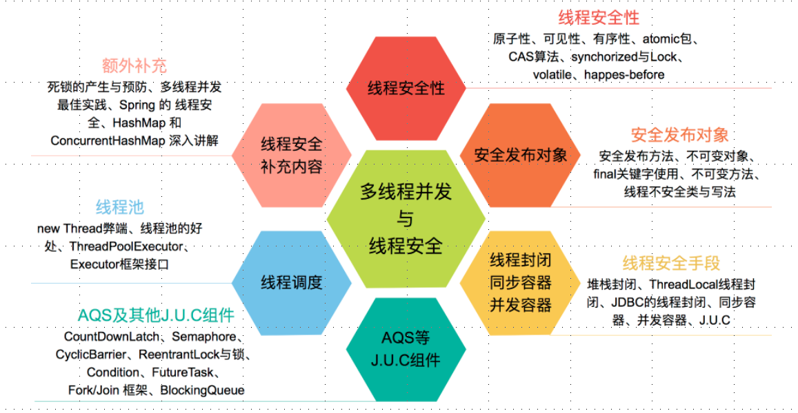

# 并发学习

## 基本概念

* 并发：同时拥有两个或者多个线程，如果程序在单核处理器上运行，多个线程将交替的换入或者换出内存，
这些线程是同时"存在"的，每个线程都处于执行过程中的某个状态，
如果运行在多核处理器上，此时，程序中的每个线程都将分配到一个处理器核上，因此可以同时运行。

* 高并发：是互联网分布式系统架构设计中必须考虑的因素之一，
它通常是指，通过系统设计保证系统能够同时并行处理很多请求。

理解：

并发：多个线程操作相同的资源,保证线程安全，合理使用资源

高并发：服务能同时处理很多请求，提高程序性能

## 学习框架

## 仓库目录
### 并发基础
- [并发基础](https://github.com/DuHouAn/ConcurrencyNotes/blob/master/notes/并发基础.md)

### 线程安全性

- [线程安全性](https://github.com/DuHouAn/ConcurrencyNotes/blob/master/notes/%E7%BA%BF%E7%A8%8B%E5%AE%89%E5%85%A8%E6%80%A7.md)

- [线程安全性相关代码](https://github.com/DuHouAn/ConcurrencyNotes/tree/master/src/main/java/code_00_threadSafe/atomic)

### 安全发布对象

- [安全发布对象](https://github.com/DuHouAn/ConcurrencyNotes/blob/master/notes/%E5%AE%89%E5%85%A8%E5%8F%91%E5%B8%83%E5%AF%B9%E8%B1%A1.md)

- [安全发布对象相关代码](https://github.com/DuHouAn/ConcurrencyNotes/tree/master/src/main/java/code_01_publishObject)

### 线程安全策略

- [线程安全策略](https://github.com/DuHouAn/ConcurrencyNotes/blob/master/notes/%E7%BA%BF%E7%A8%8B%E5%AE%89%E5%85%A8%E7%AD%96%E7%95%A5.md)

- [线程安全策略相关代码](https://github.com/DuHouAn/ConcurrencyNotes/tree/master/src/main/java/code_02_threadSafeStrategy)

### JUC之AQS

- [JUC之AQS](https://github.com/IvanLu1024/ConcurrencyNotes/blob/master/notes/J.U.C%E4%B9%8BAQS.md)

### JUC之其他组件

- [JUC之其他组件](https://github.com/IvanLu1024/ConcurrencyNotes/blob/master/notes/J.U.C%E4%B9%8B%E5%85%B6%E4%BB%96%E7%BB%84%E4%BB%B6.md)

### 线程池

- [线程池](https://github.com/IvanLu1024/ConcurrencyNotes/blob/master/notes/%E7%BA%BF%E7%A8%8B%E6%B1%A0.md)

### 多线程并发拓展

- [多线程并发拓展](https://github.com/IvanLu1024/ConcurrencyNotes/blob/master/notes/%E5%A4%9A%E7%BA%BF%E7%A8%8B%E5%B9%B6%E5%8F%91%E6%8B%93%E5%B1%95.md)

## 参考资料
[CL0610之java并发仓库](https://github.com/CL0610/Java-concurrency)
[慕课网课程之Java并发编程入门与高并发面试](https://coding.imooc.com/class/195.html)
