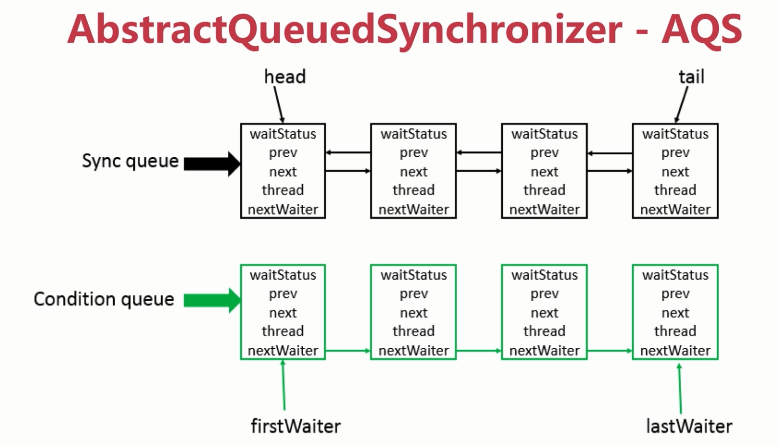
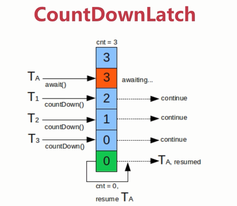
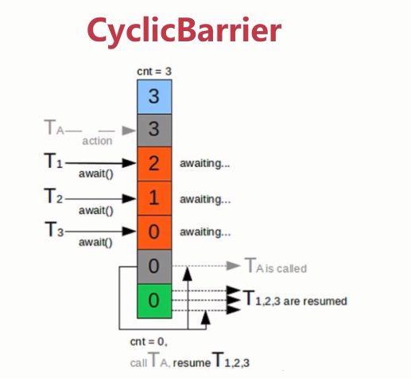

# J.U.C之AQS
## 介绍
Java从1.5之后引入了JUC包，这个包大大提升了并发执行的性能，而AQS就JUC的核心。
因此AQS是并发类中的重中之重。它提供了一个FIFO（先进先出）队列，这个队列可以用来构建锁或者其他基础框架。

AQS：AbstractQueuedSynchronizer，即队列同步器。
它是**构建锁或者其他同步组件**的基础框架（如ReentrantLock、ReentrantReadWriteLock、Semaphore等），JUC并发包的作者（Doug Lea）期望它能够成为实现大部分同步需求的基础。它是JUC并发包中的核心基础组件。
其底层的数据结构可以看做一个队列，如下图所示：



- Sync queue：双向链表，同步队列，head节点主要负责后面的调度。
- Condition queue：单向链表，不是必须的的，也可以有多个。
## 设计原理
* 使用Node实现FIFO队列，可以用于构建锁或者其他同步装置的基础框架

* 利用了一个int类型标示状态，AQS中有一个state的成员变量，基于AQS有一个同步组件（ReentrantLock），在这个组件里面，state表示获取锁的线程数（0没有线程获取锁，1有线程获取锁，大于1表示重入锁的数量）。

* 使用方法是继承，基于模板方法。

* 子类通过继承并通过实现它的方法管理其状态{acquire和release}的方法操作状态

* 可以实现排它锁和共享锁的模式（独占、共享），它是所有子类中要么使用或实现了独占功能的API，要么使用了共享锁的功能，**而不会同时使用两套API。**
## 具体实现思路
1. 首先 AQS内部维护了一个CLH队列，来管理锁

线程尝试获取锁，如果获取失败，则将等待信息等包装成一个Node结点，加入到同步队列Sync queue里

2. 接着会不断重新尝试获取锁（当前结点为head的直接后继才会尝试），如果获取失败，则会阻塞自己，直到被唤醒

3. 当持有锁的线程释放锁的时候，会唤醒队列中的后继线程。

基于以上思路，JDK中实现了我们常用的AQS的子类。
## 同步组件
* CountDownLatch：是一个闭锁，通过一个计数来保证线程是否需要一直阻塞。
* Semaphore：能够控制同一时间并发线程的数目
* CyclicBarrier：与CountDownLatch功能比较类似，都能够阻塞进程。
* ReentrantLock
* Condition
* FutureTask
## CountDownLatch


它是一个同步辅助类，通过它可以完成类似于阻塞当前线程的功能，换而言之就是一个线程或者多个线程等待直到其他线程执行的操作完成。
CountDownLatch它用了一个给定的计数器来进行初始化，该计数器的操作是原子操作（同时只能有一个线程来操作该计数器），调用类的`await()`方法会一直处于阻塞状态，
直到其它线程调用`countDown()`使得当前计数器的值为0的时候，每次调用`countDown()`的时候计数器会减1。当计数器的值变为0的时候，所有因调用`await()`方法而阻塞的
线程就会继续往下执行。这种操作只能被执行一次，因为该计数器是不能被重置的。如果使用的时候需要可重置的计数器可以考虑使用`CyclicBarrier`。
### 使用场景
1. 程序执行需要等待某个条件完成后，才能进行后面的操作。比如父任务等待所有子任务都完成的时候，在继续往下进行
- 实例1：基本用法
```java
public class CountDownLatchExample {

    private static int threadCount=200;

    public static void main(String[] args) throws InterruptedException {
        ExecutorService executorService= Executors.newCachedThreadPool();

        final CountDownLatch countDownLatch=new CountDownLatch(threadCount);

        for (int i = 0; i < threadCount; i++) {
            final int threadNum=i;
            executorService.execute(()->{
                try {
                    test(threadNum);
                } catch (InterruptedException e) {
                    e.printStackTrace();
                }finally {
                    countDownLatch.countDown();
                }

            });
        }
        countDownLatch.await();
        System.out.println("Finished!");
        executorService.shutdown();


    }

    private static void test(int threadNum) throws InterruptedException {
        Thread.sleep(100);
        System.out.println(threadNum);
        Thread.sleep(100);
    }
}
```
- 实例2：指定执行时间的情况，超过这个任务就不继续等待了，完成多少算多少。
```java
public class CountDownLatchExample1 {

    private static int threadCount=200;

    public static void main(String[] args) throws InterruptedException {
        ExecutorService executorService= Executors.newCachedThreadPool();

        final CountDownLatch countDownLatch=new CountDownLatch(threadCount);

        for (int i = 0; i < threadCount; i++) {
            final int threadNum=i;

            executorService.execute(()->{
                try {
                    test(threadNum);
                } catch (InterruptedException e) {
                    e.printStackTrace();
                }finally {
                    countDownLatch.countDown();
                }

            });
        }
        countDownLatch.await(10, TimeUnit.MILLISECONDS);
        System.out.println("Finished!");
        //不会立马关闭线程池，而是等待当前线程全部执行完再关闭线程池。
        executorService.shutdown();
        
    }

    private static void test(int threadNum) throws InterruptedException {
        Thread.sleep(5);
        System.out.println(threadNum);

    }
}
```
## Semaphore


Semaphore:信号量，用来控制并发线程的个数，与操作系统中的信号量的概念类似。
其中有`acquire()`方法，用来获取资源，`release()`方法用来释放资源。Semaphore维护了当前访问的个数，通过提供**同步机制**来控制同时访问的个数。
### 使用场景
1. 仅能提供有限访问的资源：比如数据库的连接数最大只有20，而上层的并发数远远大于20，这时候如果不做限制，
可能会由于无法获取连接而导致并发异常，这时候可以使用Semaphore来进行控制，当信号量设置为1的时候，就和单线程很相似了
- 实例：每次获取一个许可
```java
@Slf4j
public class SemaphoreExample {

    private static int threadCount=20;

    public static void main(String[] args) throws InterruptedException {
        ExecutorService executorService= Executors.newCachedThreadPool();

        final Semaphore semaphore=new Semaphore(5);


        for (int i = 0; i < threadCount; i++) {
            final int threadNum=i;
            executorService.execute(()->{
                try {
                    semaphore.acquire();    //获取一个许可
                    test(threadNum);
                    semaphore.release();    //释放一个许可
                } catch (InterruptedException e) {
                    e.printStackTrace();
                }

            });
        }
        executorService.shutdown();


    }

    private static void test(int threadNum) throws InterruptedException {
        log.info("{}",threadNum);
        Thread.sleep(1000);
    }
}
```
- 实例2：每次获取多个许可
```java
@Slf4j
public class SemaphoreExample1 {

    private static int threadCount=20;

    public static void main(String[] args) throws InterruptedException {
        ExecutorService executorService= Executors.newCachedThreadPool();

        final Semaphore semaphore=new Semaphore(3);


        for (int i = 0; i < threadCount; i++) {
            final int threadNum=i;
            executorService.execute(()->{
                try {
                    semaphore.acquire(3);    //获取一个许可
                    test(threadNum);
                    semaphore.release(3);    //释放一个许可
                } catch (InterruptedException e) {
                    e.printStackTrace();
                }

            });
        }
        executorService.shutdown();


    }

    private static void test(int threadNum) throws InterruptedException {
        log.info("{}",threadNum);
        Thread.sleep(1000);
    }
}
```
- 实例3：尝试获取许可
```java
@Slf4j
public class SemaphoreExample2 {

    private static int threadCount=20;

    public static void main(String[] args) throws InterruptedException {
        ExecutorService executorService= Executors.newCachedThreadPool();

        final Semaphore semaphore=new Semaphore(5);


        for (int i = 0; i < threadCount; i++) {
            final int threadNum=i;
            executorService.execute(()->{
                try {
                    if (semaphore.tryAcquire()){//尝试获取一个许可
                        test(threadNum);
                        semaphore.release();    //释放一个许可
                    }
                } catch (InterruptedException e) {
                    e.printStackTrace();
                }

            });
        }
        executorService.shutdown();


    }

    private static void test(int threadNum) throws InterruptedException {
        log.info("{}",threadNum);
        Thread.sleep(1000);
    }
}
```
## CyclicBarrier


CyclicBarrier也是一个同步辅助类，它允许一组线程相互等待，直到到达某个公共的屏障点(Common barrier point)。
通过它可以完成线程之间的相互等待，只有当每个线程都准备就绪后，才能各自继续往下执行。
与CountDownLatch有些相似的地方，都是通过计数器来实现的。

当某线程执行了`await()`方法的时候，进入了等待状态，计数器执行了加1的操作。
当计数器的值达到我们设置的初始值的时候，调用`await()`的线程会被唤醒继续执行操作。
由于CyclicBarrier在释放等待之后可以被重用，所以也成它为循环屏障。
### CyclicBarrier与CountDownLatch区别
1. CyclicBarrier可以重复使用（使用reset方法），CountDownLatch只能用一次
2. CountDownLatch主要用于实现一个或n个线程需要等待其他线程完成某项操作之后，才能继续往下执行，
描述的是一个或n个线程等待其他线程的关系，而CyclicBarrier是多个线程相互等待，知道满足条件以后再一起往下执行。
描述的是多个线程相互等待的场景。
### 使用场景
1.多线程计算数据，最后合并计算结果的应用场景，比如用Excel保存了用户的银行流水，
每一页保存了一个用户近一年的每一笔银行流水，现在需要统计用户的日均银行流水，
这时候我们就可以用多线程处理每一页里的银行流水，都执行完以后，得到每一个页的日均银行流水，之后通过CyclicBarrier的action，利用这些线程的计算结果，计算出整个excel的日均流水
- 实例1：
```java
@Slf4j
public class CyclicBarrierExample {

    private static int threadCount=20;

    private static CyclicBarrier cyclicBarrier=new CyclicBarrier(5);

    public static void main(String[] args) throws InterruptedException {
        ExecutorService executorService= Executors.newCachedThreadPool();


        for (int i = 0; i < 10; i++) {
            final int threadNum=i;
            Thread.sleep(1000);
            executorService.execute(()->{
                try {
                    race(threadNum);

                } catch (Exception e) {
                    e.printStackTrace();
                }

            });
        }
        executorService.shutdown();


    }

    private static void test(int threadNum) throws InterruptedException {
        log.info("{}",threadNum);
        Thread.sleep(1000);
    }

    private static void race(int threadNum) throws Exception{
        Thread.sleep(1000);
        log.info("{} is ready",threadNum);
        cyclicBarrier.await();
        log.info("{} continue",threadNum);

    }
}
```
## ReentrantLock
java一共分为两类锁，一类是由synchornized修饰的锁，还有一种是JUC里提供的锁，核心就是ReentrantLock

ReentrantLock,它实现是一种自旋锁，通过循环调用CAS操作来实现加锁，性能较好的原因是在于**避免进入进程的内核态
的阻塞状态**。想尽办法避免进入内核态的阻塞状态是我们设计锁的关键。
### synchronized与ReentrantLock的区别
 | 对比维度 | synchronized | ReentrantLock |
 | -- | -- | -- |
| 可重入性 | 可重入  | 可重入 |
| 锁的实现 | JVM实现，很难操作源码，得到实现 | JDK实现 |
| 性能 | 在引入轻量级锁（偏向锁，自旋锁）后性能大大提升，建议都可以选择的时候选择synchornized | -  |
| 功能区别 | 方便简洁，由编译器负责加锁和释放锁  | 	手工操作  |
| 粒度 | 细粒度，可灵活控制  |  |
| 可否指定公平锁 | 不可以 | 可以 |
| 可否放弃锁 | 不可以 | 可以 |

* ReentrantLock独有的功能

1. 可以指定为公平锁或非公平锁；
2. 提供了一个Condition（条件）类，可以分组唤醒需要唤醒的线程；
3. 提供了能够中断等待锁的线程机制，`lock.lockInterruptibly()`
## 使用场景：
- 实例1：基本使用
```java
@Slf4j
public class ReentrantLockExample {


    //请求总数
    public static int clientTotal=5000;

    //同时并发执行的线程数
    public static int threadTotal=200;

    public static volatile int count=0;

    private final static Lock lock=new ReentrantLock();

    public static void main(String[] args) throws InterruptedException {
        //创建线程池
        ExecutorService executorService= Executors.newCachedThreadPool();
        //定义信号量，闭锁
        final Semaphore semaphore=new Semaphore(threadTotal);

        final CountDownLatch countDownLatch=new CountDownLatch(clientTotal);
        //模拟并发
        for (int i = 0; i < clientTotal; i++) {
            executorService.execute(()->{
                try {
                    semaphore.acquire();
                    add();
                    semaphore.release();
                }catch (Exception e){
                    log.error("exception",e);
                }
                countDownLatch.countDown();

            });
        }
        //确保线程全部执行结束，阻塞进程，并保证
        countDownLatch.await();
        executorService.shutdown();
        log.info("count:{}",count);

    }

    private static void add(){
        lock.lock();
        try {
            count++;
        }finally {
            lock.unlock();
        }
    }
}
```
分析：

- 源码中的实现：
```java
/**
      默认实现了非公平锁
     * Creates an instance of {@code ReentrantLock}.
     * This is equivalent to using {@code ReentrantLock(false)}.
     */
    public ReentrantLock() {
        sync = new NonfairSync();
    }
```
## ReentrantReadWriteLock
在没有任何读写锁的时候才能取得写入的锁，可用于实现悲观读取，读多写少的场景下可能会出现线程饥饿
- 实例：
```java
public class LockExample2 {

    private final Map<String,Data> map=new TreeMap();

    private final static ReentrantReadWriteLock lock=new ReentrantReadWriteLock();

    private final static Lock readLock=lock.readLock();

    private final static Lock writeLock=lock.writeLock();

    public  Data get(String key){
        readLock.lock();
        try {
            return map.get(key);
        }finally {
            readLock.unlock();
        }

    }

    public Set<String> getAllKeys(){
        readLock.lock();
        try {
            return map.keySet();
        }finally {
            readLock.unlock();
        }

    }

    public Data put(String key,Data value){
        writeLock.lock();
        try{
            return map.put(key,value);
        }finally {
            writeLock.unlock();
        }

    }


    class Data{

    }

}
```
## StampedLock
它控制锁有三种模式：写、读和**乐观读**
状态由版本和模式两个部分组成，锁获取方法是一个数字，作为票据
（Stamped）。它用相应的锁的状态来表示和控制当前的访问
数字0表示没有写锁被授权访问；

在读锁上分为悲观读和乐观读；
乐观读：如果读的操作很多，写操作很少的情况下，我们可以乐观的认为，读写同时发生的几率很小，因此不悲观的使用读取锁定很小，
程序可以在查看相关的状态之后，判断有没有写操作的变更，再采取相应的措施，这一小小的改进，可以大大提升执行效率。

- 源码中的例子：
```java
public class LockExample4 {

    class Point {
        private double x, y;
        private final StampedLock sl = new StampedLock();

        void move(double deltaX, double deltaY) { // an exclusively locked method
            long stamp = sl.writeLock();
            try {
                x += deltaX;
                y += deltaY;
            } finally {
                sl.unlockWrite(stamp);
            }
        }

        //下面看看乐观读锁案例
        double distanceFromOrigin() { // A read-only method
            long stamp = sl.tryOptimisticRead(); //获得一个乐观读锁
            double currentX = x, currentY = y;  //将两个字段读入本地局部变量
            if (!sl.validate(stamp)) { //检查发出乐观读锁后同时是否有其他写锁发生？
                stamp = sl.readLock();  //如果没有，我们再次获得一个读悲观锁
                try {
                    currentX = x; // 将两个字段读入本地局部变量
                    currentY = y; // 将两个字段读入本地局部变量
                } finally {
                    sl.unlockRead(stamp);
                }
            }
            return Math.sqrt(currentX * currentX + currentY * currentY);
        }

        //下面是悲观读锁案例
        void moveIfAtOrigin(double newX, double newY) { // upgrade
            // Could instead start with optimistic, not read mode
            long stamp = sl.readLock();
            try {
                while (x == 0.0 && y == 0.0) { //循环，检查当前状态是否符合
                    long ws = sl.tryConvertToWriteLock(stamp); //将读锁转为写锁
                    if (ws != 0L) { //这是确认转为写锁是否成功
                        stamp = ws; //如果成功 替换票据
                        x = newX; //进行状态改变
                        y = newY;  //进行状态改变
                        break;
                    } else { //如果不能成功转换为写锁
                        sl.unlockRead(stamp);  //我们显式释放读锁
                        stamp = sl.writeLock();  //显式直接进行写锁 然后再通过循环再试
                    }
                }
            } finally {
                sl.unlock(stamp); //释放读锁或写锁
            }
        }
    }
}
```
- 实例：基本使用
```java
@Slf4j
@ThreadSafe
public class LockExample5 {


    //请求总数
    public static int clientTotal=5000;

    //同时并发执行的线程数
    public static int threadTotal=200;

    public static volatile int count=0;

    private final static StampedLock lock=new StampedLock();

    public static void main(String[] args) throws InterruptedException {
        //创建线程池
        ExecutorService executorService= Executors.newCachedThreadPool();
        //定义信号量，闭锁
        final Semaphore semaphore=new Semaphore(threadTotal);

        final CountDownLatch countDownLatch=new CountDownLatch(clientTotal);
        //模拟并发
        for (int i = 0; i < clientTotal; i++) {
            executorService.execute(()->{
                try {
                    semaphore.acquire();
                    add();
                    semaphore.release();
                }catch (Exception e){
                    log.error("exception",e);
                }
                countDownLatch.countDown();

            });
        }
        //确保线程全部执行结束，阻塞进程，并保证
        countDownLatch.await();
        executorService.shutdown();
        log.info("count:{}",count);

    }

    private static void add(){
        long stamp = lock.writeLock();
        try {
            count++;
        }finally {
            lock.unlock(stamp);
        }
    }
}
```
## Condition
```java
@Slf4j
public class LockExample6 {

    public static void main(String[] args) {
        ReentrantLock reentrantLock = new ReentrantLock();
        Condition condition = reentrantLock.newCondition();

        new Thread(() -> {
            try {
                reentrantLock.lock();
                log.info("wait signal"); // 1
                condition.await();  //从AQS队列中移除了，加入了condition的等待队列中
            } catch (InterruptedException e) {
                e.printStackTrace();
            }
            log.info("get signal"); // 4
            reentrantLock.unlock();
        }).start();

        new Thread(() -> {
            reentrantLock.lock();
            log.info("get lock"); // 2
            try {
                Thread.sleep(3000);
            } catch (InterruptedException e) {
                e.printStackTrace();
            }
            condition.signalAll();  //
            log.info("send signal ~ "); // 3
            reentrantLock.unlock();
        }).start();
    }
}
```
## 总结
* synchronized：JVM实现，不但可以通过一些监控工具监控，而且在出现未知异常的时候JVM也会自动帮我们释放锁，不会造成死锁现象;
* ReentrantLock、ReentrantRead/WriteLock、StempedLock 他们都是对象层面的锁定，**要想保证锁一定被释放**，要放到finally里面，才会更安全一些；
StampedLock对性能有很大的改进，特别是在读线程越来越多的情况下，

### 如何使用
1. 在只有少量竞争者的时候，synchronized是一个很好的锁的实现
2. 竞争者不少，但是增长的趋势是可以预估的，ReentrantLock是一个很好的锁的实现（适合自己的才是最好的，不是越高级越好）


