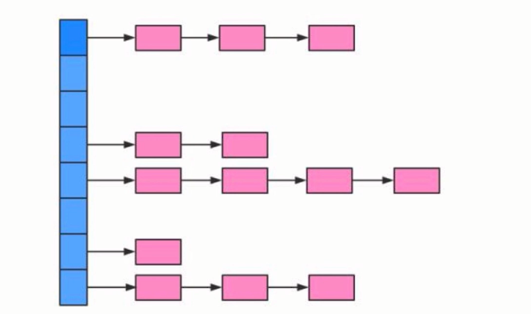
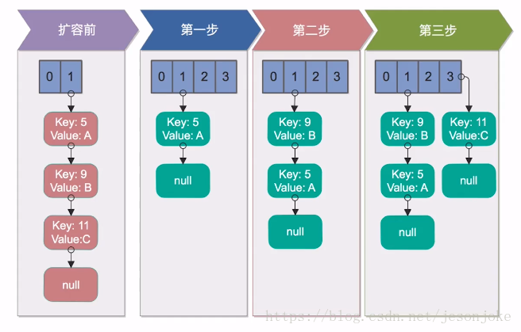
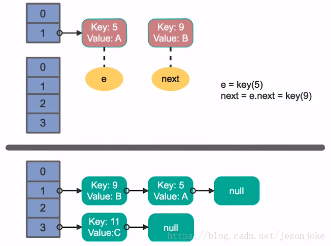
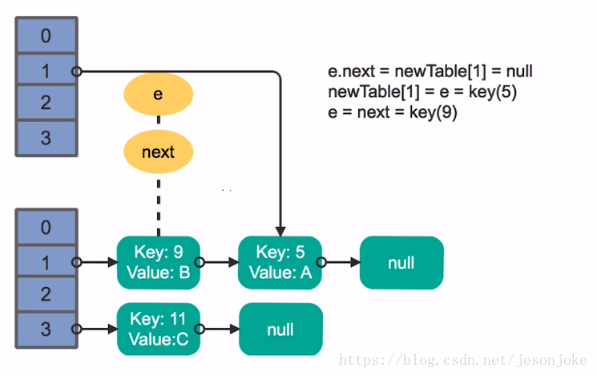
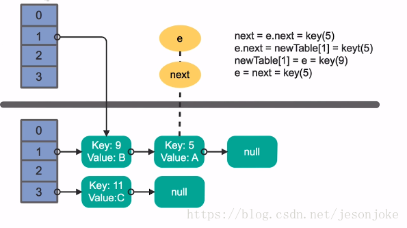
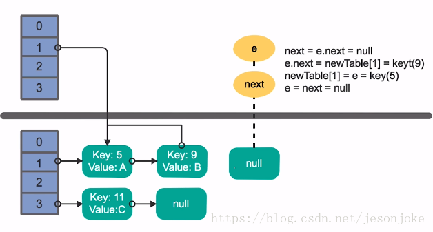
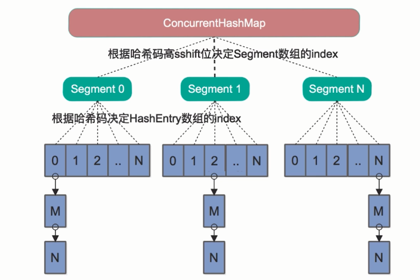
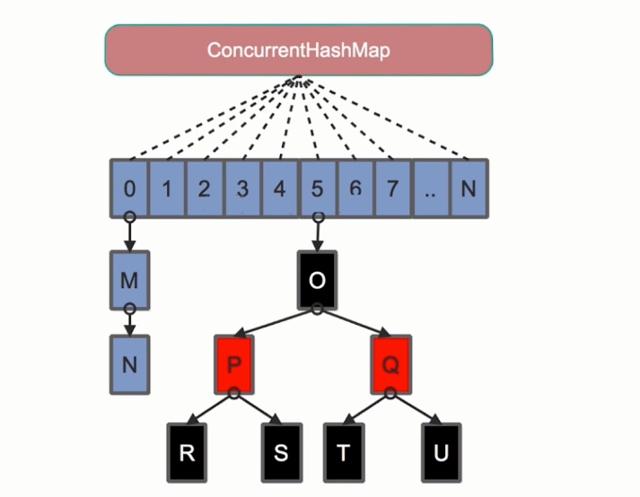

<!-- GFM-TOC -->
* [线程池](#线程池)
    * [使用线程池的好处](#使用线程池的好处)
    * [ThreadPoolExecutor](#ThreadPoolExecutor)
    * [Executor框架接口](#Executor框架接口)
<!-- GFM-TOC -->
# 多线程并发拓展
## 死锁
### 什么是死锁？
通俗的说，死锁就是两个或者多个线程，相互占用对方需要的资源，而都不进行释放，导致彼此之间都相互等待对方释放资源，产生了无限制等待的现象，如同下图中相互阻塞的汽车一样。
死锁一旦发生，**如果没有外力介入，这种等待将永远存在**，从而对程序产生严重影响。
<div align="center">  </div>

### 发生的必要条件
- 互斥条件：进程对锁分配的资源进行排他性使用，每次请求只有一个进程能够使用该资源。
- 请求和保持条件：线程已经保持了一个资源，但是又提出了其他请求，而该资源已被其他线程占用。
- 不剥夺条件：在使用时不能被剥夺，只能自己用完释放。
- 环路等待条件：资源调用是一个环形的链。
### 死锁的实例
```java
@Slf4j
public class DeadLockExample implements Runnable {
    public int flag = 1;
    //静态对象是类的所有对象共享的
    private static Object o1 = new Object(), o2 = new Object();

    @Override
    public void run() {
        log.info("flag:{}", flag);
        if (flag == 1) {
            synchronized (o1) {
                try {
                    Thread.sleep(500);
                } catch (Exception e) {
                    e.printStackTrace();
                }
                synchronized (o2) {
                    log.info("1");
                }
            }
        }
        if (flag == 0) {
            synchronized (o2) {
                try {
                    Thread.sleep(500);
                } catch (Exception e) {
                    e.printStackTrace();
                }
                synchronized (o1) {
                    log.info("0");
                }
            }
        }
    }

    public static void main(String[] args) {
        DeadLockExample td1 = new DeadLockExample();
        DeadLockExample td2 = new DeadLockExample();
        td1.flag = 1;
        td2.flag = 0;
        //td1,td2都处于可执行状态，但JVM线程调度先执行哪个线程是不确定的。
        //td2的run()可能在td1的run()之前运行
        new Thread(td1).start();
        new Thread(td2).start();
    }
}
```
### 避免死锁
* 注意加锁顺序（这个很好理解，就像上边的例子）
* 加锁时限（超过时限放弃加锁） 
* 实现方式–使用重入锁。
* 死锁检测:一种比较好的死锁预防机制，主要针对那些不可能按序加锁并且锁超时也不可行的场景。每当一个线程获得了一个锁，会在线程和锁的
数据结构中记录下来，除此之外，每当有线程请求锁的时候就记录在这个数据结构中，当一个线程请求锁失败的时候
，这个线程可以遍历锁的关系图看是否有死锁发生并决定后序操作要怎么办，这个结构需要根据实际情况来设计。当检测出死锁以后，一个可行的做法是释放所有锁回退，并且
在等待一段时间（随机）后重试，只有死锁发生才会回退；更好的方案是给这些线程设置优先级，让一个或几个线程回退，其他的线程就像没有发生过死锁一样继续保持它们的锁；如果
赋予这些线程的锁的优先级是固定不变的，那么同一批线程总会有更高的优先级，为了避免这一现象，可以在死锁发生的时候设置随机的优先级。

## 多线程并发的最佳实践
- 使用本地变量：
尽量使用本地变量而不是创建一个类或者实例的变量。
- 使用不可变量：
尽量降低代码中需要同步的变量数量
- 最小化锁的作用域范围：
S=1/(1-a+a/n),a:并行计算部分所占的比例；n:并行计算的结点个数；S:加速比
- 使用线程池的Executor,而不是直接new Thread执行
- 宁可使用同步也不要使用线程的wait和notify
- 使用BlockingQueue实现生产-消费模式
：可以处理多个生产和多个消费问题
- 使用并发集合而不是加了锁的同步集合
- 使用Semaphore创建有界的访问：
为了建立可靠稳定的系统，对于数据库、文件系统和socket等资源
必须要做有界的访问，Semaphore是一个可以限制这些资源开销的工具，可以通过它来控制同时访问资源的请求数量。
- 宁可使用同步代码块，也不使用同步的方法
- 避免使用静态变量
## Spring与线程安全
Spring能够保证线程安全性，主要是因为其无状态对象的设置。
- Spring bean:单例对象（只有在第一次被注入的时候才会被创建，其生命周期和IOC容器一致）、多例对象（每次注入的时候都会创建一个新的对象）
- 无状态对象：无状态的对象必然是线程安全的。
>无状态对象：自身没有状态的对象，不会因为多个线程的相互调度而影响其状态而导致线程安全问题，包括Dao，Service和Controller等对象
## HashMap与ConcurrentHashMap
### HashMap
HashMap的实现方式是：数组+链表 的形式。 

#### 初始化方法
其中下面两个因素主要影响其效率
- 容量：hash表中桶的容量，其在创建时候的容量
- 加载因子：表示hash表最大容纳比例，当其超过加载因子的时候，会进行扩容操作
 
源码分析：
```java
/**
     * The default initial capacity - MUST be a power of two.
     */
    static final int DEFAULT_INITIAL_CAPACITY = 1 << 4; // aka 16
    
     /**
         * The load factor used when none specified in constructor.
         */
        static final float DEFAULT_LOAD_FACTOR = 0.75f;

```

#### 寻址方式
对于一个新插入的数据或者要读取的数据，
HashMap将key按一定规则计算出hash值，并对数组长度进行**取模mod**结果作为在数组中查找的下标。
由于在计算机中取模的代价远远高于位操作的代价，因此HashMap要求数组的长度必须为2的N次方。此时它将key的hash值对2的n-1次方进行与运算，等同于取模运算。
HashMap并不要求用户一定要设置一个2的N次方的初始化大小，它本身内部会通过运算（tableSizeFor方法）确定一个合理的符合2的N次方的大小去设置。
```java
/**
     * Returns a power of two size for the given target capacity.
     */
    static final int tableSizeFor(int cap) {
        int n = cap - 1;
        n |= n >>> 1;
        n |= n >>> 2;
        n |= n >>> 4;
        n |= n >>> 8;
        n |= n >>> 16;
        return (n < 0) ? 1 : (n >= MAXIMUM_CAPACITY) ? MAXIMUM_CAPACITY : n + 1;
    }
```
#### 线程不安全的原因
1. 死循环
原因在于HashMap在多线程情况下，**执行resize()进行扩容**时容易造成死循环。 
扩容思路为它要创建一个大小为原来**两倍**的数组，保证新的容量仍为2的N次方，
从而保证上述寻址方式仍然能够适用。扩容后将原数组重新插入到新数组中，这个过程称为reHash。
* 单线程下的reHash的过程
单线程情况下完全没有问题


扩容前：HashMap初始容量为2，加载因子为1，需要向其中存入3个key，分别为5、9、11，放入第三个元素11的时候就涉及到了扩容。

    * 第一步：先创建一个两倍大小的数组，接下来将原数组中的元素reHash到新数组中，5插入新的数组，没有问题。
    * 第二步：将9插入到新的数组中，经过Hash计算，插入到5的后面。
    * 第三步：将11经过Hash插入到index为3的数组节点中。
* 多线程下的reHash的过程

我们假设有两个线程同时执行了put操作，并同时触发了reHash的操作，图示的上层的线程1，下层是线程2。

1. 线程1某一时刻执行完扩容，准备将key为5的元素的next指针指向9，由于线程调度分配的时间片被用完而停在了这一步操作
2. 线程2在这一刻执行reHash操作并执行完数据迁移的整个操作。

接下来线程1被唤醒继续操作:

执行上一轮的剩余部分，在处理key为5的元素时，将此key放在我们线程1申请的数组的索引1位置的链表的首部。理想状态是（线程1数组索引1）—> (Key=5) —> null

接着处理Key为9的元素，将key为9的元素插入在（索引1）与（key=5）之间，理想状态：（线程1数组索引1）—> （Key=9）—> （Key=5）—>null 

但是在处理完key为9的元素之后按理说应该结束了，但是由于线程2已经处理过了key=9与key=5的元素，即真实情况为（线程2数组索引1 —>（key=9）—> （key=5）—> null）|（线程1数组索引1 —> (key=9)—> （key=5）—> null），这时让线程1误以为key=9后面的key=5是从原数组还没有进行数组迁移的，接着又处理key=5。尝试将key=5放在k=9的前边，所以key=9与key=5之间就出现了一个循环。不断的被处理，交换顺序。

key = 11的元素是无法插入到新数组中的。一旦我们去从新的数组中获取值得时候，就会出现死循环。

2. fail-fast
如果在使用迭代器的过程中有其他线程修改了map，那么将抛出ConcurrentModificationException，这就是所谓fail-fast。 
在每一次对HashMap进行修改的时候，都会变动类中的modCount域，即modCount变量的值。
```java
abstract class HashIterator {
        ...
        int expectedModCount;  // for fast-fail
        int index;             // current slot

        HashIterator() {
            expectedModCount = modCount;
            Node<K,V>[] t = table;
            current = next = null;
            index = 0;
            if (t != null && size > 0) { // advance to first entry
                do {} while (index < t.length && (next = t[index++]) == null);
            }
        }
        ...
}
```
在每次迭代的过程中，都会判断modCount跟expectedModCount是否相等，如果不相等代表有人修改HashMap。
```java
final Node<K,V> nextNode() {
    Node<K,V>[] t;
    Node<K,V> e = next;
    if (modCount != expectedModCount)
        throw new ConcurrentModificationException();
    if (e == null)
        throw new NoSuchElementException();
    if ((next = (current = e).next) == null && (t = table) != null) {
        do {} while (index < t.length && (next = t[index++]) == null);
    }
    return e;
}
```
解决办法：可以使用Collections的synchronizedMap方法构造一个同步的map，或者直接使用线程安全的ConcurrentHashMap来保证不会出现fail-fast策略。
### ConcurrentHashMap

- Java7里面的ConcurrentHashMap的底层结构仍然是数组和链表，与HashMap不同的是ConcurrentHashMap的最外层不是一个大的数组，而是一个Segment数组。每个Segment包含一个与HashMap结构差不多的链表数组。
- 当我们读取某个Key的时候它先取出key的Hash值，并将Hash值得高sshift位与Segment的个数取模，决定key属于哪个Segment。接着像HashMap一样操作Segment。
- 为了保证不同的Hash值保存到不同的Segment中，ConcurrentHashMap对Hash值也做了专门的优化。
- Segment继承自J.U.C里的ReetrantLock，所以可以很方便的对Segment进行上锁。即分段锁。 

- Java8废弃了Java7中ConcurrentHashMap中分段锁的方案，并且不使用Segment，转为使用大的数组。同时为了提高Hash碰撞下的寻址做了性能优化。

- Java8在列表的长度超过了一定的值（默认8）时，将链表转为红黑树实现。寻址的复杂度从O(n)转换为Olog(n)。


### 对比
- HashMap非线程安全、ConcurrentHashMap线程安全
- HashMap允许Key与Value为空，ConcurrentHashMap不允许
- HashMap不允许通过迭代器遍历的同时修改，ConcurrentHashMap允许,并且更新可见对于后续遍历

