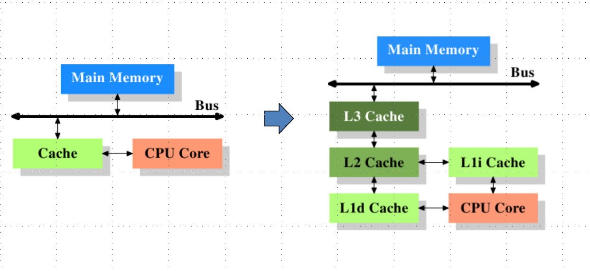

<!-- GFM-TOC -->
* [并发基础](#并发基础)
    * [CPU多级缓存](#CPU多级缓存)
    * [Java内存模型](#Java内存模型)
    * [并发的优势和风险](#并发的优势和风险)
<!-- GFM-TOC -->

# 并发基础
##  CPU多级缓存

**CPU多级缓存**：

CPU的频率太快了，快到主存跟不上，这样在处理器始终周期内，CPU常常需要等待主存，浪费资源。
所以Cache的出现是为了缓解主存和CPU之间速度不匹配的问题（结构：cpu->cache->memory）

**CPU缓存的意义**：

* 时间局部性：如果某个数据被访问，那么在不久的将来它可能会再次被访问。

* 空间局部性：如果某个数据被访问，那么与它相邻的数据很快也可能被访问。

**缓存一致性(MESI原则)**

MESI 是指4中状态的首字母。每个Cache line有4个状态，可用2个bit表示，它们分别是：

| 状态描述 | 描述 | 监听任务 |
| --- | --- | --- |
| M: Modified 修改 | 该Cache line有效，数据被修改了，**和内存中的数据不一致**，数据只存在于**本Cache**中。 | 缓存行必须时刻监听所有试图读该缓存行相对就主存的操作，这种操作必须在缓存将该缓存行写回主存并将状态变成S（共享）状态之前被延迟执行。|
| E：Exclusive 独享 | 该Cache line有效，数据**和内存中的数据一致**，数据只存在于**本Cache**中。 | 缓存行也必须监听其它缓存读主存中该缓存行的操作，一旦有这种操作，该缓存行需要变成S（共享）状态。 |
| S：Share 共享 | 该Cache line有效，数据**和内存中的数据一致**，数据存在于**很多Cache**中。 | 缓存行也必须监听其它缓存使该缓存行无效或者独享该缓存行的请求，并将该缓存行变成无效（Invalid）。 |
| E：Exclusive 独享 | 该Cache line有效，数据**和内存中的数据一致**，数据只存在于本Cache中。 | 无 |

M: Modified 修改，指的是该缓存行只被缓存在该CPU的缓存中，并且是被修改过的，因此他与主存中的数据是不一致的，
该缓存行中的数据需要在未来的某个时间点（允许其他CPU读取主存相应中的内容之前）写回主存，然后状态变成E（独享）

E：Exclusive 独享，
缓存行只被缓存在该CPU的缓存中，是未被修改过的，与主存的数据是一致的，
可以在任何时刻当有其他CPU读取该内存时，变成S（共享）状态，当CPU修改该缓存行的内容时，变成M（被修改）的状态

，
意味着该缓存行可能会被多个CPU进行缓存，并且该缓存中的数据与主存数据是一致的，
当有一个CPU修改该缓存行时，其他CPU是可以被作废的，变成I(无效的)
  
I：Invalid 无效的，代表这个缓存是无效的，可能是有其他CPU修改了该缓存行

状态之间的转换关系：

local read：读本地缓存的数据

local write：将数据写到本地缓存里面

remote read：将内（主）存中的数据读取到缓存中来

remote write：将缓存中的数据写会到主存里面

在一个典型的多核系统中，
每一个核都会有自己的缓存来共享主存总线，每一个CPU会发出读写（I/O）请求，而缓存的目的是为了减少CPU读写共享主存的次数；
**一个缓存除了在Invaild状态，都可以满足CPU 的读请求**。

一个写请求只有在M状态，或者E状态的时候才能被执行，如果是处在S状态的时候，他必须先将该缓存行变成I状态，
这个操作通常通过于广播的方式来完成，
这个时候它既不允许不同的CPU同时修改同一个缓存行，即使是修改同一个缓存行中不同端的数据也是不可以的，
这里主要解决的是缓存一致性的问题，
一个M状态的缓存行必须时刻监听所有试图读该缓存行相对主存的操作，
这种操作必须在缓存该缓存行被写会到主存，并将状态变成S状态之前，被延迟执行

一个处于S状态的缓存行，也必须监听其他缓存使该缓存行无效，或者独享该缓存行的请求，并将缓存行变成无效

一个处于E状态的缓存行，他要监听其他缓存读缓存行的操作，一旦有，那么他将变成S状态

因此对于M和E状态，他们的数据总是一致的与缓存行的真正状态总是保持一致的，
但是S状态可能是非一致的，如果一个缓存将处于S状态的 缓存行作废了，另一个缓存可能已经独享了该缓存行，
但是该缓存确不会将该缓存行升迁为E状态，这是因为其他缓存不会广播他们已经作废掉该缓存行的通知，
同样由于缓存并没有保存该缓存行被COPY的数量，因此没有办法确定是否独享了改缓存行，
这是一种投机性的优化，因为如果一个CPU想修改一个处于S状态的缓存行，总线需要将所有使用该缓存行的COPY的值变成Invaild状态才可以，而修改E状态的缓存 却不需要这样做

##  Java内存模型

## 并发的优势和风险
优势：

* 1、速度：同时处理多个请求，响应更快；复杂的操作可以分为多个进城同时进行

* 2、设计：程序生化危机在某些情况下更简单，也可以更多的选择

* 3、资源利用：CPU能够在等待IO的时候，做一些其他的事情

风险：

* 1、安全性：多个线程共享数据时可能会产生与且期望不相符的结果

* 2、活跃性：某个操作无法继续进行下去时，就会发生活跃性问题。比如死锁、饥饿等问题。

* 3、性能：线程过多时会使CPU频繁切换，调度时间增多；同步机制；消耗过多内存
