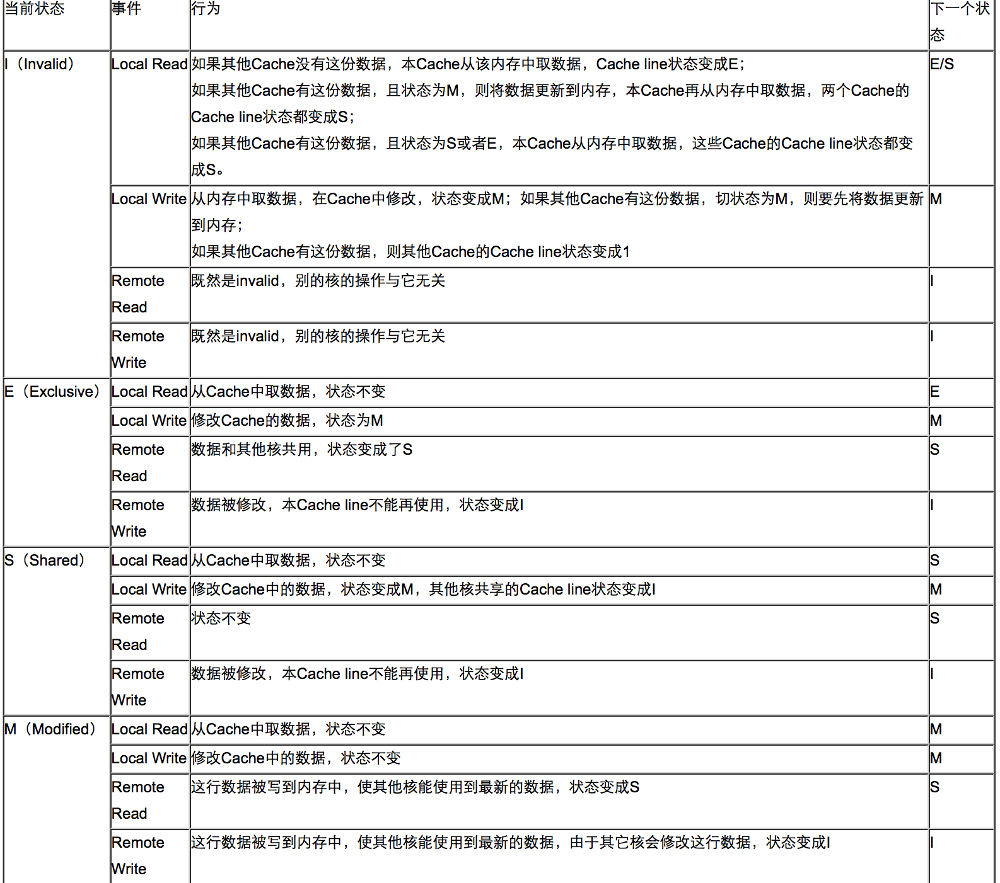

<!-- GFM-TOC -->
* [并发基础](#并发基础)
    * [CPU多级缓存](#CPU多级缓存)
    * [Java内存模型](#Java内存模型)
    * [并发的优势和风险](#并发的优势和风险)
<!-- GFM-TOC -->

# 并发基础
##  CPU多级缓存

**CPU多级缓存**：

CPU的频率太快了，快到主存跟不上，这样在处理器始终周期内，CPU常常需要等待主存，浪费资源。
所以Cache的出现是为了缓解主存和CPU之间速度不匹配的问题（结构：cpu->cache->memory）

**CPU缓存的意义**：

* 时间局部性：如果某个数据被访问，那么在不久的将来它可能会再次被访问。

* 空间局部性：如果某个数据被访问，那么与它相邻的数据很快也可能被访问。

**缓存一致性(MESI原则)**

MESI 是指4种状态的首字母。每个Cache line有4个状态，可用2个bit表示，它们分别是：

| 状态描述 | 说明 | 描述 |
| --- | --- | --- |
| M: Modified 修改 | 该Cache line有效，数据被修改了，**和内存中的数据不一致**，数据只存在于**本Cache**中。 | 该缓存行中的内存需要在未来的某个时间点（允许其它CPU读取请主存中相应内存之前）写回（write back）主存。 当被写回主存之后，该缓存行的状态会变成独享（exclusive)状态。 |
| E：Exclusive 独享 | 该Cache line有效，数据**和内存中的数据一致**，数据只存在于**本Cache**中。 | 该状态可以在任何时刻当有其它CPU读取该内存时变成共享状态（shared)。 同样地，当CPU修改该缓存行中内容时，该状态可以变成Modified状态。 |
| S：Share 共享 | 该Cache line有效，数据**和内存中的数据一致**，数据存在于**很多Cache**中。 | 当有一个CPU修改该缓存行中，其它CPU中该缓存行可以被作废（变成无效状态（Invalid））。 |
| I:Invalid 无效 | 该Cache line无效。 | 无 |

* 触发事件:

| 触发事件 | 描述 |
| --- | --- |
| 本地读取（Local read） | 本地cache读取本地cache数据 |
| 本地写入（Local write） | 本地cache写入本地cache数据 |
| 远端读取（Remote read） | 其他cache读取本地cache数据 |
| 远端写入（Remote write） | 其他cache写入本地cache数据 |

* cache分类：

前提：所有的cache共同缓存了主内存中的某一条数据。
  
| cache分类 | 解释 |
| --- | --- |
| 本地cache | 指当前cpu的cache |
| 触发cache | 触发读写事件的cache |
| 其他cache | 指既除了以上两种之外的cache |
  
注意：本地的事件触发 本地cache和触发cache相同。

* MESI状态转换：

* 切换的解释：

**CPU多级缓存的乱序执行优化**：

处理器为提高运算速度而做出违背代码原有顺序的优化
 

导致的一个问题，如果我们不做任何处理，在多核的情况下，
实际结果可能和逻辑运行结果大不相同，
如果在一个核上执行数据写入操作，并在最后执行一个操作来标记数据已经写入好了，
而在另外一个核上通过该标记位判定数据是否已经写入，这时候就可能出现不一致，标记位先被写入，
但是实际的操作却并未完成，这个未完成既有可能是没有计算完成，也有可能是缓存没有被及时刷新到主存之中，
使得其他核读到了错误的数据。

##  Java内存模型

## 并发的优势和风险
优势：

* 1、速度：同时处理多个请求，响应更快；复杂的操作可以分为多个进城同时进行

* 2、设计：程序生化危机在某些情况下更简单，也可以更多的选择

* 3、资源利用：CPU能够在等待IO的时候，做一些其他的事情

风险：

* 1、安全性：多个线程共享数据时可能会产生与且期望不相符的结果

* 2、活跃性：某个操作无法继续进行下去时，就会发生活跃性问题。比如死锁、饥饿等问题。

* 3、性能：线程过多时会使CPU频繁切换，调度时间增多；同步机制；消耗过多内存
