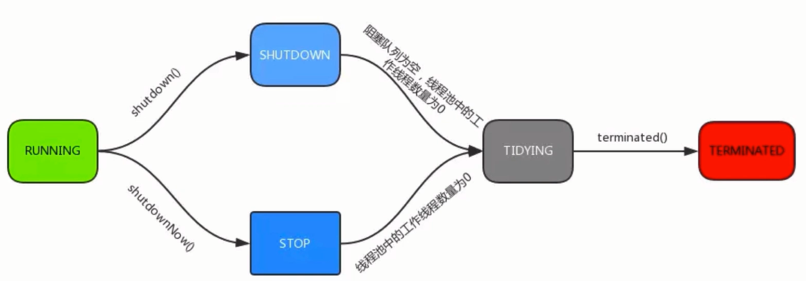

<!-- GFM-TOC -->
* [线程池](#线程池)
    * [使用线程池的好处](#使用线程池的好处)
    * [ThreadPoolExecutor](#ThreadPoolExecutor)
    * [Executor框架接口](#Executor框架接口)
<!-- GFM-TOC -->

# 线程池
##使用线程池的好处
### new Thread弊端
* 每次new  Thread，新建对象，性能差

* 线程缺乏统一管理，可能无限制的新建线程，相互竞争，
有可能占用过多下同资源导致司机或OOM

* 缺少更多功能，如更多执行、定期执行、线程中断

### 线程池的好处
* 重用存在的线程没减少对象创建、消亡的开销，性能差

* 可有效控制最大并发线程数，提高系统资源利用率，
同事可以避免过多资源金正，避免阻塞

* 提供定时执行、定期执行、单线程、并发控制等功能

## ThreadPoolExecutor

* 构造方法参数

| 构造方法的参数 | 解释 |
| :---: | :---: |
| corePoolSize | 核心线程数量 |
| workQueue | 阻塞队列，存储等待执行的任务，很重要，会对线程池运行过程产生重大影响 |
| maximumPoolSize | 最大线程数 |
| keepAliveTime | 线程没有任务执行时最多保持多久时间终止 |
| unit | keepAliveTime的事件单位 |
| threadfactory | 线程工厂，用来创建线程 |
| rejectHandler | 当拒绝处理任务时的策略 |

* 线程池实例的几种状态

<div align="center">  </div>


* 常用方法：

| 方法 | 解释 |
| :---: | :---: |
| execute() | 提交任务，交给线程池执行 | 
| submit() | 提交任务，能够返回执行结果 Future| 
| shutdown() | 关闭线程池，等到任务都执行完 | 
| shutdownNow() | 关闭线程池，不等到任务都执行完 | 
| getTaskCount() | 线程池已执行和未执行的任务总数 | 
| getCompletedTaskCount()| 已完成的任务数量 | 
| getPoolSize() | 线程池当前的线程数量 | 
| getActiveCount() | 当前线程池正在执行任务的线程数量 | 

## Executor框架接口
### 线程池类图

<div align="center">  </div>


### 4种线程池
*  Executors.newCachedThreadPool()

创建一个可缓存线程池，如果线程池长度超过处理需要，可灵活回收空闲线程，若无可回收，则新建线程。

线程池为无限大，当执行第二个任务时第一个任务已经完成，会复用执行第一个任务的线程，而不用每次新建线程。
```java
public class ThreadPoolExample1 {
    public static void main(String[] args) {
        ExecutorService executorService= Executors.newCachedThreadPool();
        for(int i=0;i<10;i++){
            final int index=i;
            executorService.execute(new Runnable() {
                @Override
                public void run() {
                    System.out.println("task:{"+index+"}");
                }
            });
        }
        executorService.shutdown();
    }
}
/**
 * 输出结果：
 task:{0}
 task:{1}
 task:{2}
 task:{3}
 task:{4}
 task:{5}
 task:{6}
 task:{8}
 task:{9}
 task:{7}
 */
```

* Executors.newFixedThreadPool(int)

创建一个定长线程池，可控制线程最大并发数，超出的线程会在队列中等待。
```java
public class ThreadPoolExample2 {
    public static void main(String[] args) {
        ExecutorService executorService= Executors.newFixedThreadPool(3);
        for(int i=0;i<10;i++){
            final int index=i;
            executorService.execute(new Runnable() {
                @Override
                public void run() {
                    try {
                        Thread.sleep(1000);
                    } catch (InterruptedException e) {
                        e.printStackTrace();
                    }
                    System.out.println("task:{"+index+"}");
                }
            });
        }
        executorService.shutdown();
    }
}
/**
 * 输出结果：每隔1s输出一组（因为线程池大小为3，每个任务输出index后sleep 1秒，所以每隔1秒打印3个数字。）
 task:{0}
 task:{2}
 task:{1}

 task:{4}
 task:{5}
 task:{3}

 task:{8}
 task:{7}
 task:{6}

 task:{9}
 */
```

* Executors.newSingleThreadExecutor()

创建一个单线程化的线程池，它只会用唯一的工作线程来执行任务，保证所有任务按照指定顺序(FIFO, LIFO, 优先级)执行。

```java
public class ThreadPoolExample3 {
    public static void main(String[] args) {
        ExecutorService executorService= Executors.newSingleThreadExecutor();
        for(int i=0;i<10;i++){
            final int index=i;
            executorService.execute(new Runnable() {
                @Override
                public void run() {
                    System.out.println("task:{"+index+"}");
                }
            });
        }
        executorService.shutdown();
    }
}
/**
 * 输出结果：结果依次输出，相当于顺序执行各个任务。
 task:{0}
 task:{1}
 task:{2}
 task:{3}
 task:{4}
 task:{5}
 task:{6}
 task:{7}
 task:{8}
 task:{9}
 */
```
*  Executors.newScheduledThreadPool(int)

创建一个定长线程池，支持定时及周期性任务执行。

```java
public class ThreadPoolExample4 {
    public static void main(String[] args) {
        ScheduledExecutorService executorService = Executors.newScheduledThreadPool(1);

        //延迟11s执行
       /*executorService.schedule(new Runnable() {
           @Override
           public void run() {
               System.out.println("schedule rum");
           }
       },11, TimeUnit.SECONDS);
       executorService.shutdown();*/

       //延迟1秒后每3秒执行一次
        executorService.scheduleAtFixedRate(new Runnable() {
            @Override
            public void run() {
                System.out.println("schedule rum");
            }
        },1,3,TimeUnit.SECONDS);

       //每隔5s执行
        Timer timer = new Timer();
        timer.schedule(new TimerTask() {
            @Override
            public void run() {
                System.out.println("timer run");
            }
        }, new Date(), 5 * 1000);

    }
}
/**
 * 表示延迟1秒后每3秒执行一次。
 * ScheduledExecutorService比Timer更安全，功能更强大。
 */
```